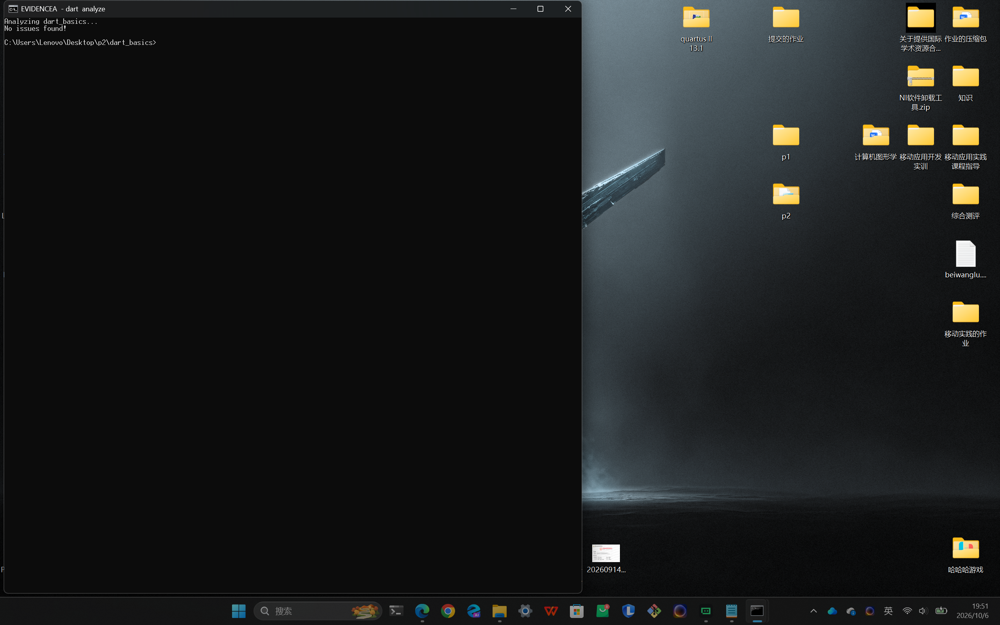
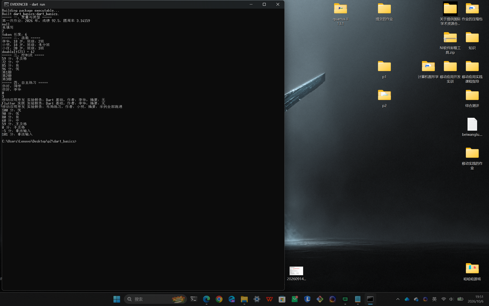
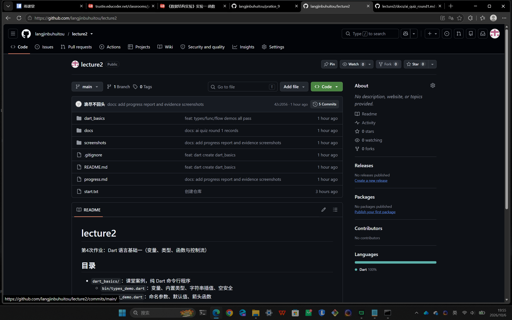
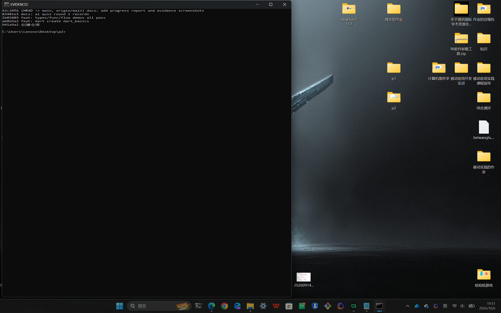
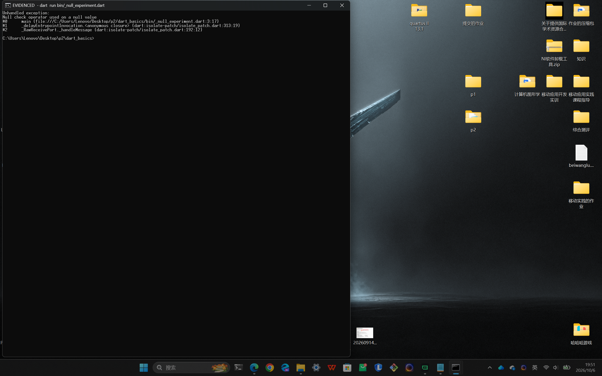
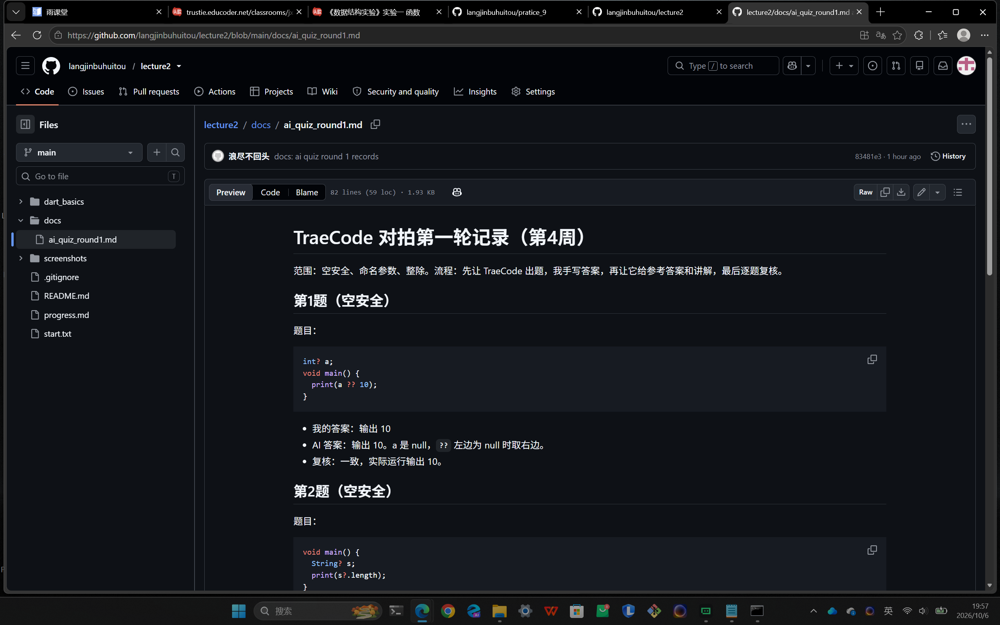

# 进度报告2（第4周·Dart语言基础一）

## 一、任务理解

这次作业分两块。第一块是跟着指南把课堂案例 dart_basics 做出来：用 dart create 建一个纯 Dart 工程，写变量和类型、函数、控制流三组示例，每完成一步做一次 Git 提交，最后 dart run 能正常跑。第二块是自己完成 5 个任务：空安全改写、命名参数设计、成绩分级器扩展、TraeCode 对拍记录、AI 使用标注。

验收标准：dart run 输出全部正确；dart analyze 没有告警；Git 至少 3 次提交且提交说明按要求写；对拍记录要有题目、我的答案、AI 答案和分歧复核。

## 二、环境与工具

- 系统：Windows 11
- Dart SDK：3.13.4（stable），用 dart run 在命令行直接运行，不用浏览器和模拟器
- Git：2.55.0
- 编辑器：Trae（TraeCode）
- AI 工具：TraeCode，用来对拍出题、批改和解释报错，代码都自己跑过验证

## 三、过程记录

1. 运行 dart create -t console dart_basics 建好工程，做第一次提交。
2. 在 bin 目录下写 types_demo.dart（变量、插值、空安全四件套）、func_demo.dart（命名参数和箭头函数）、flow_demo.dart（成绩分级器和 for-in），改 main 统一调用，dart run 看输出，做第二次提交。
3. 写 practice.dart：空安全改写、实验报告生成器函数、分级器扩展（处理 100、0 和非法输入）。
4. dart analyze 时出现 2 个告警，改掉后再次分析确认 No issues found，再跑一遍 dart run。
5. 按指南做故意实验：在 null 上用 !，记录运行时报错。
6. 让 TraeCode 出 5 道预测输出题，先手写答案再对答案，分歧处自己运行核实，记录存到 docs/ai_quiz_round1.md，并提交到仓库。
7. 截 dart analyze、dart run、git log、GitHub 仓库首页、空断言报错和对拍记录的全屏图放进报告。

## 四、关键代码

第1段：空安全四件套里最常用的两个符号（types_demo.dart，自己写的，用 dart run 验证）。

```dart
void showNullable(String? nickname) {
  print(nickname?.length); // 是 null 就短路，输出 null
  print(nickname ?? '未填写'); // 是 null 就用后面的默认值
}
```

解释：参数写成 String? 表示可能是 null。第一行 ?. 是安全调用，左边为 null 时整句直接得 null，不会崩；第二行 ?? 是给个退路，左边为 null 时用右边的值。

第2段：空安全改写前后对照（practice.dart，自己写的；写完让 TraeCode 帮看有没有问题，它说可以）。

```dart
// 改写前：要么编译不过，要么运行时崩
// String greet(String? name) => '你好，' + name;
// void printLength(String? s) => print(s!.length);

String greet(String? name) {
  return '你好，${name ?? '同学'}'; // 没传名字就叫“同学”
}

void printLength(String? s) {
  print(s?.length ?? 0); // 为 null 时输出 0
}
```

解释：改写思路是“先把 null 处理掉再使用”。字符串拼接 + 不接受 null，就改成插值并在里面用 ?? 给默认值；printLength 里危险的 ! 去掉，换成 ?. 配合 ??。验证：分别传 null 和正常字符串，dart run 输出符合预期。

第3段：成绩分级器扩展（practice.dart，自己写的）。

```dart
String gradeOfV2(int score) {
  if (score < 0 || score > 100) return '非法输入';
  if (score >= 90) return '优';   // 100 分也走这一档
  if (score >= 80) return '良';
  if (score >= 60) return '中';
  return '不及格';                // 0 分走这里
}
```

解释：先挡掉 0 到 100 以外的输入，然后从高分往低分判断，命中就返回。用 100、90、80、60、59、0、-5、101 八个数逐个验证，结果都对。

## 五、检查点结果

- dart analyze：No issues found!（见第八节图1），空安全没有编译告警。
- dart run：全部输出正确（见第八节图2），包括 null、未填写、2，三个 enroll 调用结果，以及分级器 100 到 101 的八组结果。
- 口头解释：?? 是“左边为 null 就用右边”；! 是“我保证它不是 null”，保证错了程序就崩，要少用。
- 故意实验：对 null 用 !，运行报错 Null check operator used on a null value，和指南说法一致（见第八节图5）。
- Git：一共 5 次提交（git log 见第八节图4）；仓库地址 https://github.com/langjinbuhuitou/lecture2，仓库首页见图3。
- 对拍记录：5 道题（含 1 处分歧复核）已存入仓库 docs/ai_quiz_round1.md（见第八节图6）。

## 六、问题与调试

问题1：第一次照指南写局部变量 String? nickname; 然后用 nickname?.length，赋值成 hu 以后又写 nickname!.length，dart analyze 报了两个告警：dead_code 和 unnecessary_non_null_assertion。

- 定位：分析器能看出局部变量一直没赋值就是 null，所以 ?. 后面的代码永远走不到（死代码）；赋值之后它又能自动推断出已经不是 null，这时 ! 就是多余的。
- 解决：把可空变量改成函数参数传进来，分析器没法提前知道参数是不是 null，告警消失，意思不变。

问题2：命令行里运行 git log 时报 cannot spawn more，看不到记录。

- 定位：Git 想调用分页器 more，但这个终端里找不到它。
- 解决：改用 git --no-pager log，记录直接打印出来。

## 七、AI使用记录

| 用途 | 指令摘要 | AI 输出 | 我的验证 |
| --- | --- | --- | --- |
| 对拍出题 | 围绕空安全、命名参数、整除出 5 道预测输出题，先别给答案 | 给了 5 道小题 | 我先手写答案再让它批改 |
| 对拍批改 | 把我的答案发过去，要参考答案和讲解 | 5 题答案和讲解，第 5 题和我不一样 | 分歧题自己 dart run 验证，确实我错了 |
| 代码检查 | 贴空安全改写代码，问有没有问题 | 说写法可以，提醒 ! 尽量少用 | dart analyze 无告警，运行结果对 |
| 解释告警 | 贴 dead_code 等两个告警 | 解释局部变量类型提升的原因 | 按它的思路改成函数参数，告警消失 |

所有 AI 给的结论我都自己跑过一遍，没有直接提交没验证的 AI 代码。

## 八、证据截图

图1（全屏截图）：dart analyze 的结果，No issues found!，没有告警。



图2（全屏截图）：dart run 的完整输出，四组示例结果都在。



图3（全屏截图）：GitHub 上的 lecture2 仓库首页，地址栏是仓库地址，页面上能看到文件列表和 5 Commits。



图4（全屏截图）：git --no-pager log --oneline 的输出，共 5 次提交，最新一次已推送到 origin/main。



图5（全屏截图）：按指南做的故意实验，在 null 值上使用空断言 !，运行报 Unhandled exception: Null check operator used on a null value。



图6（全屏截图）：仓库里的对拍记录 docs/ai_quiz_round1.md，每题都有题目、我的答案、AI 答案和复核结论。



## 九、自评

| 自查项 | 完成情况 |
| --- | --- |
| dart_basics 完整复现 | 完成，三组示例加自主练习都在 bin 目录下 |
| dart run 输出全部正确 | 完成，见截图 |
| 空安全无编译告警 | 完成，dart analyze 无问题 |
| Git 规范（至少 3 次提交） | 完成，5 次提交，提交说明均按指南写 |
| 空安全改写并解释 | 完成，practice.dart 里有前后对照 |
| 命名参数设计（三种调用） | 完成，buildReport 三种调用结果都正确 |
| 分级器处理边界和非法输入 | 完成，100、0、-5、101 都验证过 |
| TraeCode 对拍一组 | 完成，5 题，1 处分歧已运行核实 |
| AI 使用标注 | 完成，见第七节 |
| 仓库含 README | 完成 |

## 十、一句话收获与下一步计划

- 一句话收获：?? 给退路、?. 不崩、! 少用，三个符号把 null 管住了。
- 遗留问题：switch 的表达式形式（Dart 3 的模式匹配）还不太熟，后面再补。
- 下一步：预习第 3 课的 List、Map、Set 集合用法，提前看 dart.dev/language/collections。
